<div align="center">
  

  # 🐶 CORGI 🐶

  **One file runs your whole project.** Every repo, database, service, and the env vars between them. `corgi run` starts all of it. That same file is what your AI agents work in, what CI boots, and what your phone connects to.

  [](LICENSE)
  [](#install)
  [](docs/install.md)
  [](https://sonarcloud.io/summary/new_code?id=Andriiklymiuk_corgi)

</div>

A feature is rarely one repo. It's an API change, a web change, a mobile change, and a migration. corgi describes all of that in one `corgi-compose.yml` and runs it, so you can build the whole feature at once:

```text
                          ┌─ you       corgi run            whole stack up, one command
                          │
  corgi-compose.yml ──►   ├─ an agent  /corgi:stories        ticket ─► code ─► draft PR per repo
   (committed, shared)    │
                          ├─ your CI   corgi test --e2e      every repo's branch, one suite
                          │
                          └─ your phone  scan a QR           send work to this laptop from anywhere
```

<p align="center">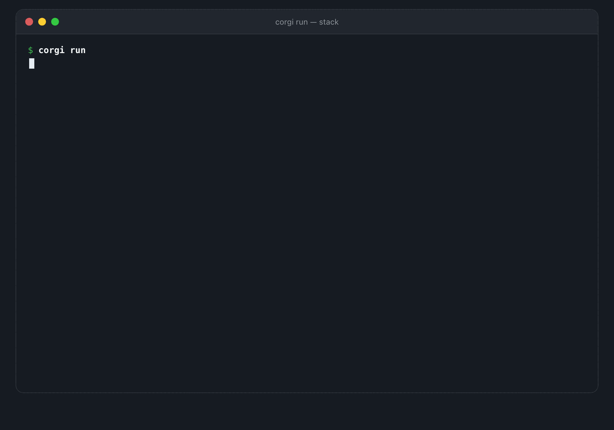</p>

<p align="center">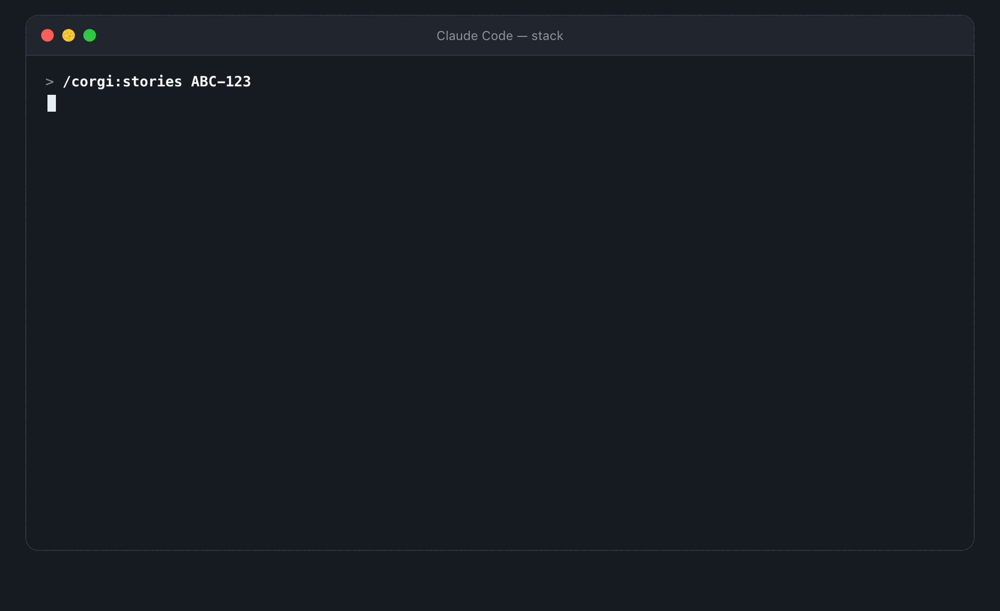</p>

<p align="center">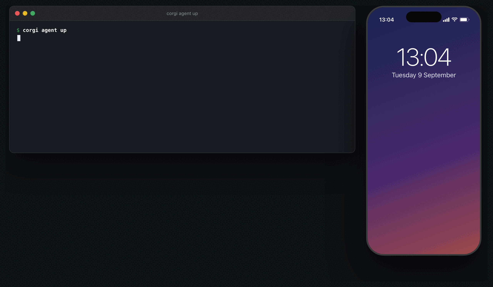</p>

Video: [2-minute showcase](https://youtu.be/rlMCjs4EoFs?si=o3SQaymM55zxBCUY).

**Install:** `brew install andriiklymiuk/homebrew-tools/corgi` (Homebrew 5 asks you to `brew trust andriiklymiuk/tools` once; [other ways](docs/install.md)). Then, in Claude Code with the plugin: **`/corgi:setup`** installs the rest — VS Code extension, menu bar app, the daemon at login with a tunnel and the pairing QR, notifications, session tracking — and lists the few clicks only you can do.

## Why corgi

One committed `corgi-compose.yml` describes the project. After that, the things you actually do in
a day are one command each:

| what you want | what you type |
| --- | --- |
| the whole stack up: repos cloned, databases seeded, env wired | `corgi run` |
| a feature that spans `api`, `web` and `mobile` | `corgi run --feature ABC-123` |
| a teammate's branch, in one service only | `corgi run --service-branch api=fix/login` |
| just the databases, to write a migration against | `corgi db -u` |
| the bug reproduced on yesterday's data | `corgi db restore nightly` |
| a public HTTPS URL for a webhook or a device | `corgi tunnel` |
| the same stack in CI, on the branches under review | `corgi run --feature $BRANCH --detach --wait` |
| an agent to take the ticket across every repo | `/corgi:stories ABC-123` |
| your laptop still working while you're out | `corgi agent up`, then scan the QR |
| which of your Claude sessions is waiting on you: menu bar, VS Code, Stream Deck | `corgi agent track enable` |
| a new bug or a PR review handled while you are away | `corgi agent watch enable --action fix` |
| the next project tomorrow | the same commands, in its folder |

The part that changes how you work is the second row. A feature that touches three repos normally
means three checkouts, three terminals and a lot of hoping. `--feature ABC-123` runs every repo
that has that branch and leaves the rest on `main`, so the mobile app calls the real endpoint,
which reads the real seeded database, on your laptop. You see the whole feature work before you
open a PR.

The rest of the list is why it stays installed: databases you can seed, snapshot and restore, env
files written for you, health you can watch, logs kept after the process dies, and the same five
commands on every project instead of a bespoke `make dev` per repo. Your
[agent](#let-an-agent-take-a-whole-ticket), your [CI](#run-the-whole-stack-in-ci) and your
[phone](#code-from-your-phone) drive that same file.

If you already use `docker-compose`, keep it. corgi runs the repos, seed data, env files and tool
checks around your containers.

## Quick start

```bash
brew install andriiklymiuk/homebrew-tools/corgi   # or see Install below

corgi run -l        # browse runnable examples, pick one to try

# in your own project, next to a corgi-compose.yml:
corgi doctor        # check required tools, ports, docker
corgi run           # start every database + service, together
corgi status -w     # watch each service turn healthy
```

```text
corgi-compose.yml  ─►  corgi run
                         ├─ clone missing repos
                         ├─ start + seed databases (in Docker)
                         ├─ write + wire .env between services
                         └─ run services as host processes
                                    ↓
                         whole stack running 🐶   (Ctrl-C tears it all down)
```

> **Agents & CI:** use `corgi run --detach` then `corgi status --ready --timeout 2m` instead of the foreground commands above — they return instead of blocking. See [agents & scripting](docs/agents.md).

No `corgi-compose.yml` yet? `corgi create` writes a starter one, or `/corgi-new` writes one with Claude.

## What the file looks like

A seeded Postgres, a Go API that corgi clones for you, and a web app:

```yml
db_services:
  db:
    driver: postgres
    databaseName: app
    port: 5432
    seedFromFilePath: ./seed.sql            # loaded on first run

services:
  api:
    cloneFrom: https://github.com/acme/api.git   # cloned if ./api isn't there yet
    path: ./api
    port: 7012
    depends_on_db:
      - name: db                            # puts DB_HOST/DB_PORT/DB_NAME/... in api/.env
    start:
      - go run .
  web:
    cloneFrom: https://github.com/acme/web.git
    path: ./web
    depends_on_services:
      - name: api                           # puts api's URL in web/.env
    start:
      - yarn dev
```

`corgi run` clones what's missing, seeds Postgres, writes the `.env` files, then runs `api` and `web` together. `Ctrl-C` stops all of it. For every available field, run `corgi docs` or browse the [examples repo](https://github.com/Andriiklymiuk/corgi_examples).


## Let an agent take a whole ticket

Give an agent a corgi workspace and it has what it usually lacks: every repo, databases with real data, the env between services, and a way to start the whole thing. So it can read a ticket, change three services, run the stack to check the result, and open a draft PR in each repo.

```text
tracker ticket ABC-123
   │
   ▼
agent reads the whole workspace
   ├─ edits  api/  ·  web/  ·  mobile/
   ├─ corgi run --detach      boots the real stack (seeded DBs, wired env)
   ├─ corgi status --ready    waits until healthy, then tries the feature
   └─ draft PR per repo  ──►  you review, you merge
```

[Install corgi](#install), then add the [Claude Code](https://claude.com/claude-code) plugin (other agents: `npx skills add Andriiklymiuk/corgi`):

```
/plugin marketplace add Andriiklymiuk/corgi
/plugin install corgi@corgi
```

Slash-commands and plain English both work:

```
/corgi:stories ABC-123          "build a referral program across the services"
/corgi:review <pr-url>          "fix the comments on this MR and answer them"
/corgi-run                      "run the todo stack, then show me the logs"
/corgi-tracker                  "how's the team doing — anything stuck?"
/corgi-queue                    "I just joined — what should I pick up first?"
/corgi-debug                    "the api is 500ing, find out why"
/corgi-complexity               "this handler branches like a jungle — simplify it"
/corgi-risk <pr-url>            "how much review does this need — can it be auto-approved?"
/corgi:setup                    "set corgi up for me: agent, phone, Telegram, menu bar, Stream Deck"
/corgi:showcase                 "make README gifs of the new feature"
```

Nothing ships without you. It opens **draft** PRs and waits. If you have no project to try this on, `corgi run -l` fetches an example.

<p align="center"></p>

corgi is built to be driven by a program: it never stops to ask a question, prints JSON with `--json`, and returns exit codes you can branch on (`0` ok, `1` failed, `2` bad usage). It also ships an **MCP server**, so an agent calls real tools instead of guessing shell commands:

```bash
corgi mcp                        # stdio, local, no network — point any MCP client at it
corgi mcp --http :8765 --tunnel  # remote: a bearer-token-protected public URL
```

More: [agents & scripting](docs/agents.md) · [MCP server](docs/mcp.md) · [planning from your tracker](docs/tracker.md).

## Code from your phone

Run `corgi agent up` on your laptop and scan the QR once. Your phone now has a
launcher: every repo you registered, one tap each. Tap one and a Claude Code
session starts on the laptop — your files, your databases, your credentials — and
you drive it and answer its permission prompts from the phone. The branch is
waiting when you get back to the desk.

That one command is the whole setup, and it works in a corgi stack **or any git
repo**:

```text
$ corgi agent up

  ✓ workspace registered
  ✓ agent daemon running
  ✓ tunnel  https://…trycloudflare.com
  ✓ pairing open · scan with your phone to pair

  █▀▀▀▀▀█  ▀ ▀▄▄ ▀  █▀▀▀▀▀█
  █ ███ █  ▀ ▄▄ ▀▄  █ ███ █
  █ ▀▀▀ █  ▄▄█▄▄▄ ▀ █ ▀▀▀ █
  ▀▀▀▀▀▀▀ ▀ ▀▄█▄█▄▀ ▀▀▀▀▀▀▀
   ▄▄▄▄▄▀  ▄█ ▀▄██▄▄ ▄▄  ▄ 
   ▀▄ ██▀▀ ▄██▀ █████ ▄▄   
  ▄█▄ ▀ ▀▄▄▄ ▀ ▄ ▀▄▀██▀▄ █▀
   ▄▀▄▄▀▀▀▄ █▀█▄▀███    ▀ █
   ▀▀   ▀  ▄▀ ▄▄█ █▀▀▀█▀ █▀
  █▀▀▀▀▀█    ▄ ▀▄ █ ▀ █▀█▄ 
  █ ███ █  ██▀ █ ▀█▀▀█▀▄▀▄▀
  █ ▀▀▀ █  ▄██ ▄▄█▀▀▀ ▀█▄▀ 
  ▀▀▀▀▀▀▀  ▀ ▀▀▀ ▀▀ ▀  ▀ ▀ 
```

```text
📱 scan QR ──► launcher (one URL, all workspaces)
                 ├─ dev-stack   [open in: app]     ──► Claude app
                 └─ client-app  [open in: chrome]  ──► Chrome (its own account)
```

One scan pairs the phone. It gets its own token, revocable without touching your other devices. Each workspace remembers where it should open — personal projects in the Claude app, a work repo on a different Claude account in Chrome signed into that account. Save the launcher to your home screen and it is one tap after that.

<p align="center">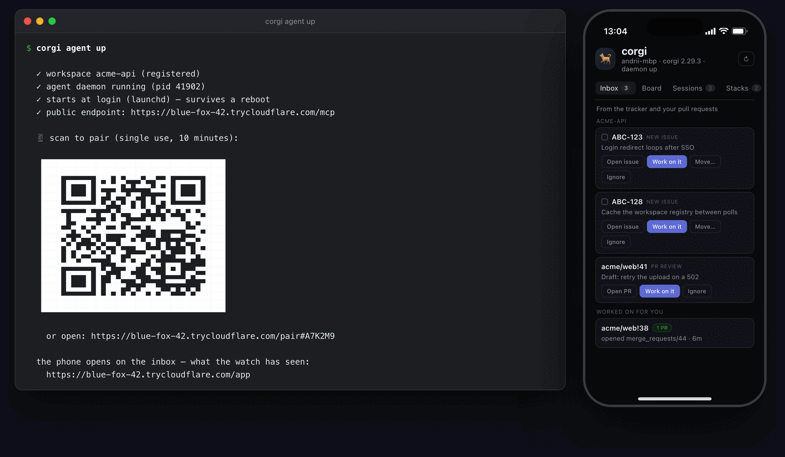</p>

**Adding your other repos.** `agent up` registered the directory you ran it in, and the launcher lists only what is registered. Add the rest:

```bash
cd ~/dev/api && corgi agent init          # register this repo and enable it
corgi agent init --config-dir ~/.claude-work   # …under a different Claude account

corgi agent scan ~/dev                    # find repos under a folder and register them
                                          # (registers only; enable each with agent init)

corgi agent workspaces                    # list them · forget <id> drops one
```

`agent init` writes `.corgi/agent.yml` in the repo. It carries identity only, so it is safe to commit:

```yaml
version: 1
workspace:
  id: acme-stack
  aliases: [acme, recipe app]
```

Which Claude account it runs under, and whether it starts on its own, live in your own machine's config instead — a cloned repo can never decide that. The new repo shows up in the launcher on the next refresh; no re-pairing.

**What corgi is doing for you.** The session itself is Claude's own
[Remote Control](https://code.claude.com/docs/en/remote-control) — corgi
reimplements none of it, and never asks you to start it. What corgi adds is
everything that has to be true before a phone is any use:

- **It is running when you are not there.** `corgi agent up --at-login` brings the daemon, the endpoint and the tunnel back at login, so the laptop answers after a reboot without you having set anything up before you left. Sessions come back after a crash, and a wake lock stops the laptop sleeping through a long task. If one dies anyway, `corgi agent brief` says where it stopped and which repo it left dirty. The supervised servers wait as **devices**, not as pre-opened conversations, so a restart leaves no empty `corgi · main · 10:00` rows in your session list — a session exists once you start one, from the launcher or the Claude app.
- **Every repo, on its own Claude account.** One launcher lists them all. Personal projects open in the Claude app; a work repo opens in Chrome signed into the work account.
- **One branch across the whole stack.** A session is not stuck in one directory: corgi puts the same branch in every repo that has it, and hands back a single diff over all of them — readable on the phone with no tunnel and nothing running.

**Keeping the same URL.** By default `agent up` opens a free Cloudflare quick tunnel, and that URL is different every time it restarts — so the bookmark on your phone goes stale and you re-pair. Pick one of these instead, once:

```bash
# phone on the same Wi-Fi: no tunnel at all, nothing public
corgi agent up --http 0.0.0.0:8765          # save http://<your-lan-ip>:8765/app

# a domain you own, on a free Cloudflare account
cloudflared tunnel login
cloudflared tunnel create corgi-agent
cloudflared tunnel route dns corgi-agent corgi.yourdomain.com
corgi agent tunnel setup corgi.yourdomain.com   # remembered from now on

# no domain, still permanent
corgi agent tunnel setup <yours>.ngrok-free.dev --provider ngrok
```

`agent tunnel setup` stores the choice, so plain `corgi agent up` keeps using it after that. Because the origin stops changing, the phone stays paired across restarts and reboots — save `https://<your-host>/app` to the home screen and it keeps working.

`corgi agent down` turns everything off, and nothing runs again until you start it. macOS and Linux. With the plugin, `/corgi-remote` walks you through the whole setup. Full guide: [docs/agent.md](docs/agent.md).

## See every Claude session at once

`corgi agent track enable` hooks into Claude Code. The daemon then keeps a
board: every session on the machine, its window and tab, whether it works,
waits for you, finished or hit the usage limit, its context fill, what it
does right now. Three clients show it:

| client | what it adds |
|---|---|
| [corgi-bar](https://github.com/Andriiklymiuk/corgi-bar), macOS menu bar | rows by workspace, Allow/Deny, accounts with 5-hour and weekly windows and a forecast, Talk, a prompt field |
| [VS Code extension](https://marketplace.visualstudio.com/items?itemName=Corgi.corgi) | Agent sessions view, status bar item, a toast with Go when a session in another window waits |
| [Corgi Agent Deck](https://github.com/Andriiklymiuk/corgi-agent-deck), Stream Deck | one key per session, Talk, Prompt and Budget keys |

<p align="center"> </p>

<p align="center"></p>

They all run the same commands:

```bash
corgi agent sessions --watch            # the board
corgi agent focus acme-api              # that window, that tab
corgi agent send acme-api --enter "run the tests"
corgi agent answer acme-api allow       # the permission prompt it waits on
corgi agent usage                       # every account: windows and forecast
corgi agent carry acme-api --profile work   # continue under another account
corgi agent standup                     # yesterday, from sessions and git
corgi agent watch enable --labels bug --prs --action fix   # new bugs and PR reviews: tell me, or fix them
```

A Telegram bot has the same: reply to a "needs you" message to type into
that session, `/allow`, `/sessions`, `/usage`. Details in
[docs/agent.md](docs/agent.md#sessions-on-a-stream-deck).

<p align="center">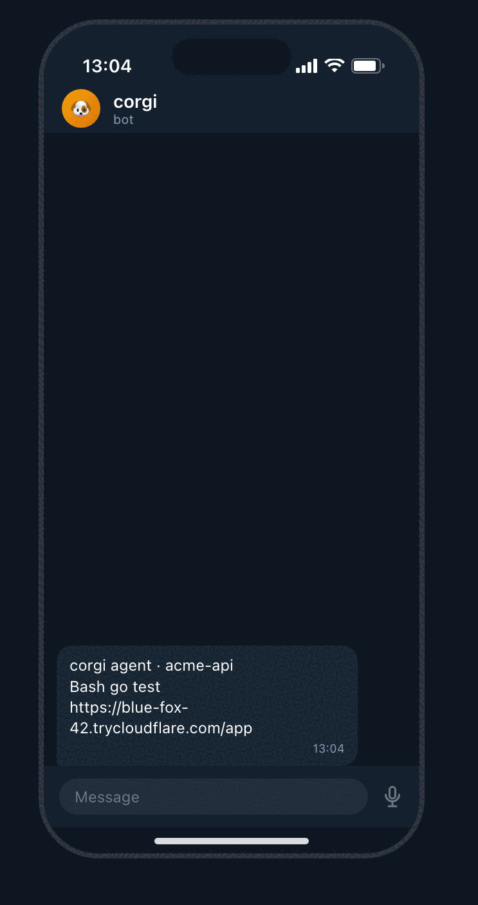</p>

**Work that arrives while you are away.** `corgi agent watch` has the daemon
poll Linear or Jira and GitHub or GitLab, with a saved cursor, so a round
that finds nothing costs one request and no agent tokens. A new bug
assigned to you, a comment on it, a review on your PR: you get the
notification, and with `--action fix` a headless Claude runs the matching
skill in the workspace and opens draft PRs. Webhooks (`corgi agent watch
hooks`) make it instant. Details in
[docs/agent.md](docs/agent.md#watching-the-tracker-and-your-pull-requests).

<p align="center">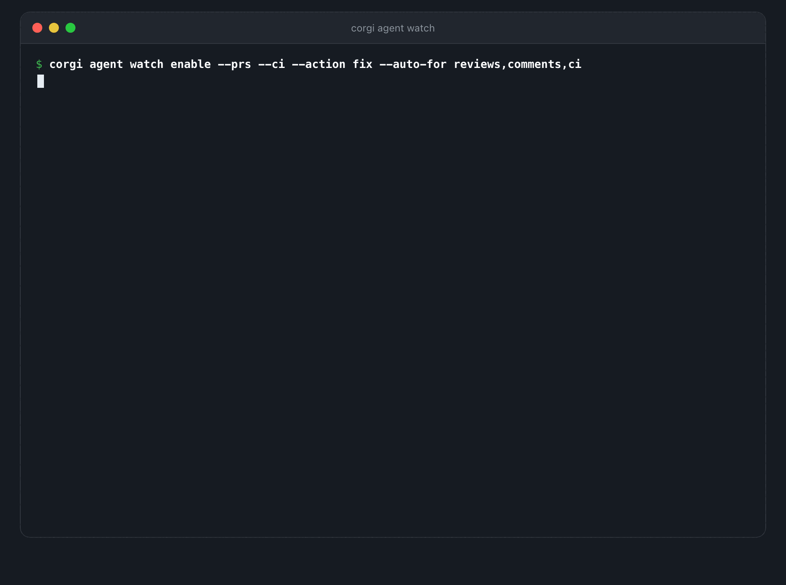</p>

**An agent that works while you do not.** `--auto-for` decides what it takes
on its own, and the point is that it is a choice per kind rather than all or
nothing:

```bash
corgi agent watch enable --action fix --auto-for tickets,reviews,comments,ci \
  --prs --ci --reviews --lease --quiet 23:00-07:00 \
  --pickup "In Progress" --review-status "In Review"
```

A ticket assigned to you moves itself twice: to **In Progress** when a run
takes it, and to **In Review** once that run has opened a pull request, with
the link posted on the ticket. Each finished run also reaches wherever
`notifyUrl` points — Telegram, Slack, ntfy — with the pull request as the link,
and is kept in `corgi agent while-away` for the morning.

- **review comments** and **red builds** are the safest to hand over: both are
  already scoped, and a build brings its own test for "done".
- **a fresh ticket** is a blank page — leave it reporting until the rest has
  earned trust. It waits in the inbox with a *Work on it* button that hands it
  to a session you can watch.
- **someone else's pull request** needs `--reviews` to reach you at all and is
  never worked on unattended: corgi reads it and posts a review, and will not
  push to their branch.

Every unattended run reviews its own diff before it reports, stamps the pull
request with where it came from, and is capped by what a run on that workspace
usually costs rather than by a count. What it will not do is as deliberate: a
comment on a ticket that is already done, a ticket closed as a duplicate, four
comments on one pull request, or a ticket another machine has claimed
(`--lease`). `corgi agent watch replay` shows the week it *would* have had
before you turn it on, and `corgi agent watch undo` puts a run back.

<p align="center">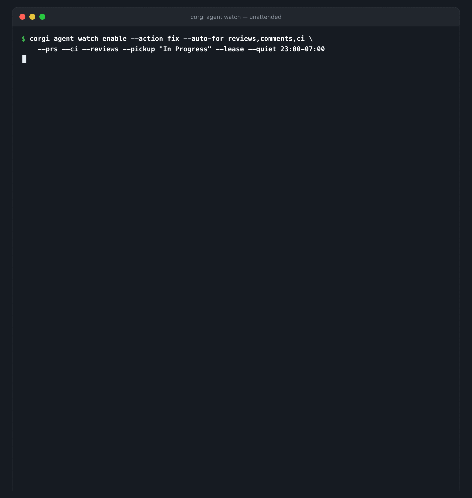</p>

<p align="center">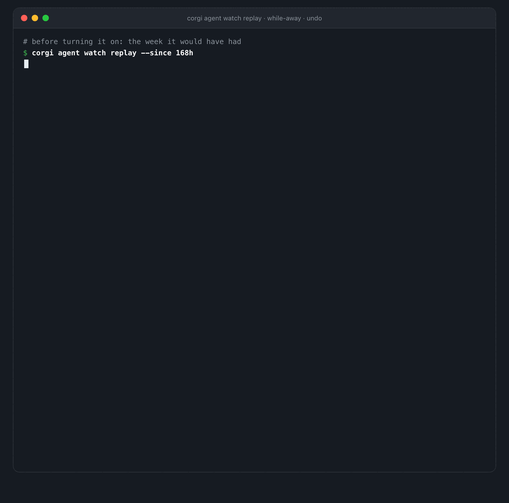</p>

## The rest of the commands

Beyond the ones above, these are the ones that come up in a normal week:

| command | what you get |
| --- | --- |
| `corgi run --tier staging` | local services pointed at your staging env tier |
| `corgi db shell` | a native `psql`/`mysql` shell with the password already filled in |
| `corgi db snapshot` | freeze the current database state so you can come back to it |
| `corgi exec api -- go test ./...` | a one-off command in that service's directory and env |
| `corgi logs --service api` | logs kept after the process is gone |
| `corgi status -w` · `corgi ps` | health and run state while you work |
| `corgi mc` | one pane: each service's run state with its branch, PR and CI |
| `corgi open web` | opens the localhost URLs in the browser |
| `corgi doctor --fix` | missing tools, busy ports, Docker not running |
| `corgi memory list` | decisions and incidents the team commits next to the code |

38 database drivers ([list](docs/databases.md)), and all of this behaves the same whether the
project has one service or twelve.

<p align="center">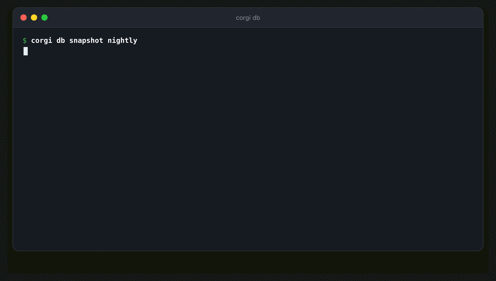</p>

<p align="center">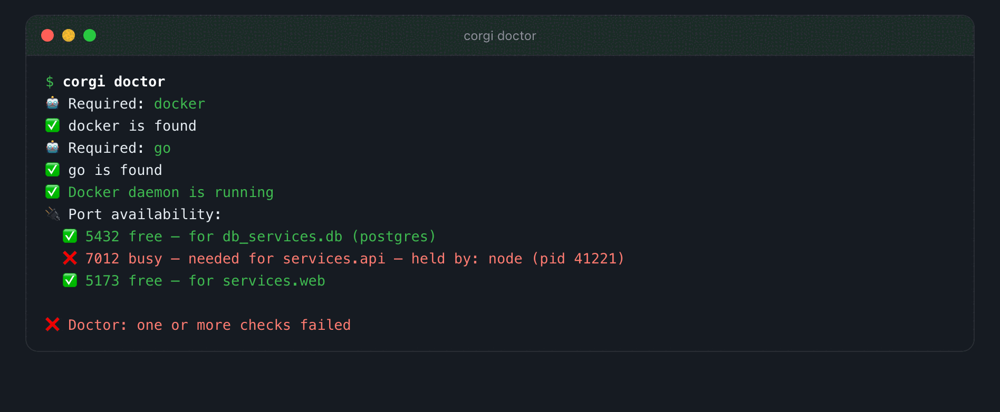 </p>

<p align="center">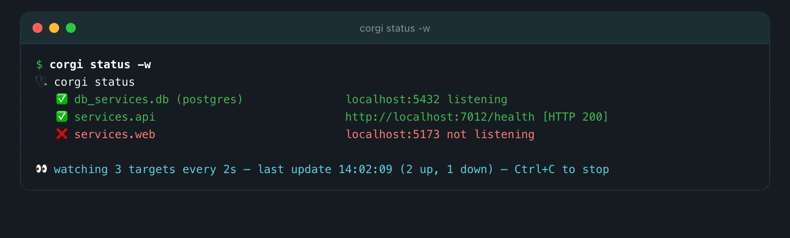</p>

<p align="center">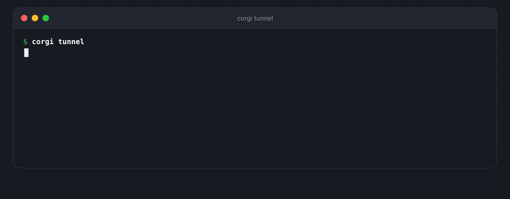</p>

<p align="center">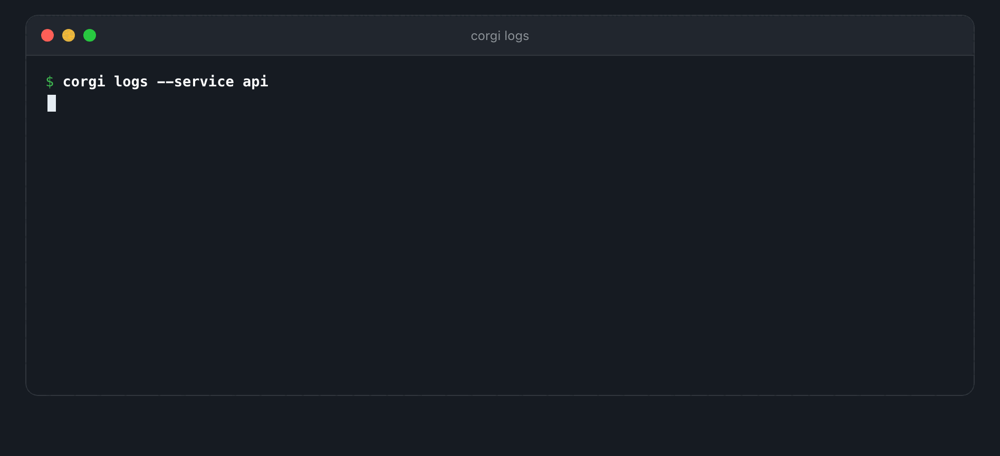</p>

Private repos, prerequisites, secrets or staging tiers? See
[Getting it running on a real project](docs/getting-started.md).

## Working across many repos

corgi treats your repos as part of the stack, not as something you keep in sync on the side.

- **Auto-clone** — `cloneFrom:` clones a service when its folder is missing. A plain `path:` (a monorepo subfolder, or a repo you manage yourself) runs in place. You can mix both.
- **`corgi pull`** pulls every repo at once. **`corgi fork`** forks them to your account.
- **`corgi checkout main`** puts every repo back on `main` and fast-forwards it. A repo that calls its trunk something else falls back to its own default branch, and a repo with uncommitted work is skipped, not clobbered.
- **Run one service on a branch**, without editing the file:

```bash
corgi run --service-branch api=feature/login   # api's branch in its own worktree
corgi run --feature ABC-123                     # every repo that has the branch joins in
```

`--feature` takes one branch name. Every repo that has that branch runs from a worktree, and the rest stay where they are. Good for testing a PR branch, or for letting an agent work on a branch while you keep running `main`.

<p align="center">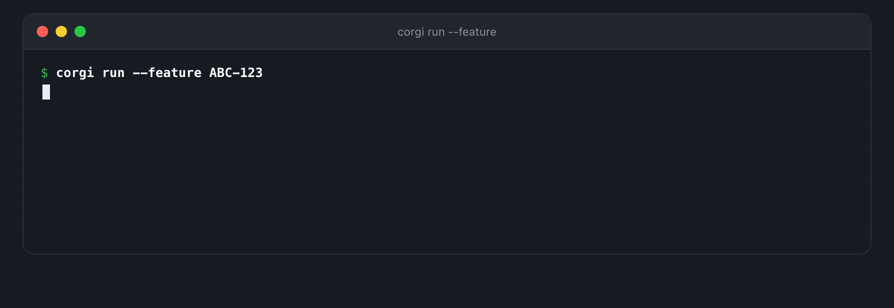</p>

## Run the whole stack in CI

Each repo's pipeline only proves that repo works alone, so the bug that only shows up in the combination still ships. corgi's CI job starts the whole stack from the branches under review and runs one e2e suite against it.

corgi detects CI and runs non-interactive. With the official action the job is a few lines:

```yaml
- uses: Andriiklymiuk/corgi@v1                     # install corgi + a cache plan
- run: corgi init --depth 1 --feature "$BRANCH"    # shallow-clone every repo with the change
- run: corgi run --feature "$BRANCH" --detach --wait   # boot the stack, block until healthy
- run: corgi test --e2e                            # one e2e suite across the live stack
```

`--feature` tests each PR against the exact combination it will ship into. `--wait` blocks until every service is healthy, so there is no `sleep 60` in your pipeline. Full guide: [Run the stack in CI](https://andriiklymiuk.github.io/corgi/docs/ci).

<p align="center">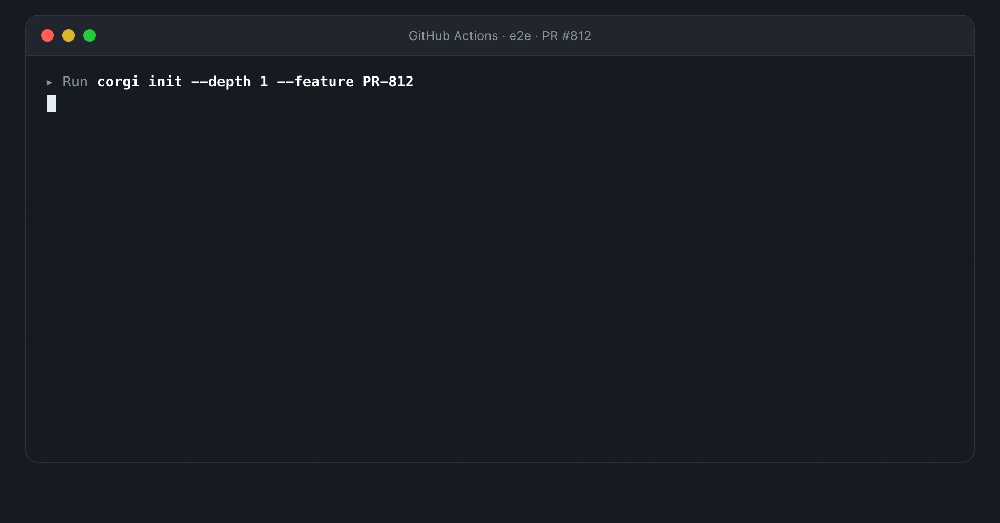</p>

## Security & scope

- **corgi is not a deploy tool.** It runs and tests your stack on your laptop and in CI. Shipping to staging and prod stays with your CI/CD. If you already use `docker-compose`, keep it: corgi runs around your containers.
- A `corgi-compose.yml` runs its `start` commands on your machine, so only run files you trust. That goes double for `corgi run -t <url>`, which runs a file from somewhere else.
- `corgi doctor --fix` will start Docker for you, but **installing a tool or killing whatever holds a port always asks first** (or `--yes` in CI).
- `corgi mcp` is local stdio by default. `--http` is **unauthenticated**, so only expose it with `--tunnel`, which adds a bearer token. Treat that URL and token like a credential.
- **No telemetry.** The only call corgi makes on its own is `corgi update` checking GitHub for a newer release.

## Install

```bash
brew install andriiklymiuk/homebrew-tools/corgi
```

No Homebrew? One line, checksum-verified:

```bash
curl -fsSL https://raw.githubusercontent.com/Andriiklymiuk/corgi/main/install.sh | sh
```

Windows, Scoop, mise, pkgx, shell completion, VSCode extension: **[full install guide](docs/install.md)**. Then `corgi -h`.

## Documentation

- Full docs site: https://andriiklymiuk.github.io/corgi/
- [Agents & scripting](docs/agents.md) (JSON, exit codes, errors) · [MCP server](docs/mcp.md) · [Tracker planning](docs/tracker.md)
- [Work from your phone](docs/agent.md) · [Databases & drivers](docs/databases.md) · [Real-project setup](docs/getting-started.md)
- [Run in CI](https://andriiklymiuk.github.io/corgi/docs/ci) · [Tunnels](docs/tunnel.md) · [Install](docs/install.md)

[](https://sonarcloud.io/summary/new_code?id=Andriiklymiuk_corgi)
[](https://sonarcloud.io/summary/new_code?id=Andriiklymiuk_corgi)

If corgi saved you a day, [a star](https://github.com/Andriiklymiuk/corgi) helps other people find it. 🐶

## Credits

- `corgi tunnel` defaults to [cloudflared](https://github.com/cloudflare/cloudflared) and its free [Quick Tunnels](https://developers.cloudflare.com/cloudflare-one/connections/connect-networks/do-more-with-tunnels/trycloudflare/). Thanks to Cloudflare. [ngrok](https://ngrok.com) and [localtunnel](https://github.com/localtunnel/localtunnel) also work.
- <a href="https://www.freepik.com/free-vector/cute-corgi-dog-astronaut-floating-space-cartoon-vector-icon-illustration-animal-science-icon-concept-isolated-premium-vector-flat-cartoon-style_22271104.htm#query=corgi%20icon&position=7&from_view=keyword">Corgi image by catalyststuff</a> on Freepik
