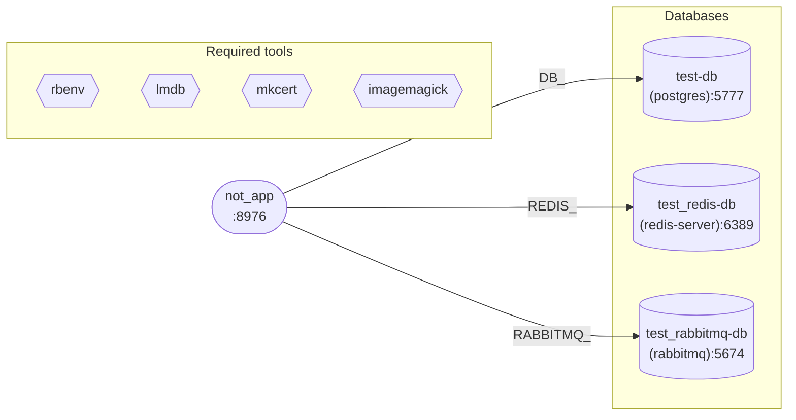

# Simple test compose file with valkey db

| Tool | checkCmd | Optional |
|---|---|---|
| rbenv | `rbenv -v` | no |
| lmdb | `brew --prefix lmdb` | no |
| mkcert | `mkcert --version` | no |
| imagemagick | `brew --prefix imagemagick` | no |

## Databases

| name | driver | host:port | db / user |
|---|---|---|---|
| `test-db` | postgres | `localhost:5777` | `test` / `user` |
| `test_redis-db` | redis-server | `localhost:6389` | — / `user` |
| `test_rabbitmq-db` | rabbitmq | `localhost:5674` | — / `guest` |

### `test_rabbitmq-db` — extras

- **Additional** `definitionPath: ./rabbitmq_definition.json`

## Services

### `not_app` `:8976`

- **Source** `path: .` → project root
- **copyEnvFromFilePath** `.env-staging`
- **README** > Send someone your project yml file, init and run it in minutes. [Sonar: Andriiklymiuk_corgi](https://sonarcloud.io/project/overview?id=Andriiklymiuk_corgi).

**Deps**

| target | kind | envAlias | resolved |
|---|---|---|---|
| `test-db` | db | `DB_` | postgres → `DB_HOST`/`DB_PORT`/`DB_USER`/`DB_PASSWORD`/`DB_NAME` |
| `test_redis-db` | db | `REDIS_` | redis-server → `REDIS_HOST`/`REDIS_PORT`/`REDIS_USER` |
| `test_rabbitmq-db` | db | `RABBITMQ_` | rabbitmq → `RABBITMQ_HOST`/`RABBITMQ_PORT`/`RABBITMQ_USER`/`RABBITMQ_PASSWORD` |

## Cycles & warnings

- DB envAlias `"none"` on all three `depends_on_db` entries is the literal string `none`, not an empty/null alias. If intent is "use driver default prefix", corgi may still inject `DB_`/`REDIS_`/`RABBITMQ_`; if intent is to suppress env injection, this won't do it. Verify against driver behaviour.
