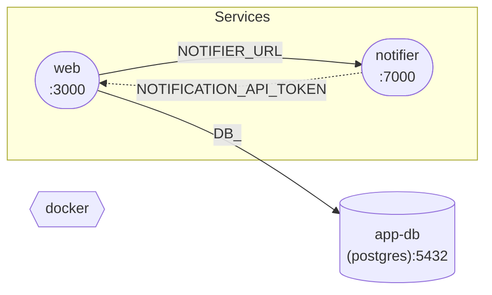

# `/corgi-describe` output format

The slash command `/corgi-describe` writes a single Markdown file (default: `docs/corgi-services.md`). Goal: **compact**. Reader scans once, sees relationships, drills only into services they care about. Skip every empty/default field. Don't restate the schema — describe **this** project.

## Compactness rules (enforced)

1. **Skip empty.** No `_not set_`, no `none`, no placeholders. Field missing → omit line.
2. **No metadata table** unless `useDocker` or `useAwsVpn` is explicitly set. One-line description at top is enough.
3. **No per-DB subsection** unless DB has `additional.*`, `seed*`, `version`, or `healthCheck`. Plain DBs collapse into one shared table.
4. **No per-service subsection wrappers** — use `### svc-name` then compact bullets/tables directly. No `#### Lifecycle commands` / `#### DB dependencies` / `#### Service dependencies` / `#### Exports` headers. Use bold inline labels (`**Deps:**`, `**Env:**`, `**Lifecycle:**`).
5. **Combine db+svc deps** into one "Deps" table per service.
6. **README → 1–3 lines max:** tagline + sonar key (linked) + repo URL if present. Never dump the badge list. Never dump useful-links section. If only badges exist, emit sonar line only.
7. **Drop "Inbound env references" / "Consumed by"** — diagram already shows reverse direction.
8. **Skip "Lifecycle hooks (project-level)"** entirely if all commands are pure `echo` (debug noise). Same for per-service lifecycle: skip echo-only blocks. Keep if any real command.
9. **Skip "Environment" prose section** — env vars belong in the deps table or are visible in `environment:`. Only list env entries that reference `${producer.VAR}` (export consumers), since those drive the dotted graph edges.
10. **Cycles & warnings** section appears only when non-empty.

## File skeleton

(Outer fence uses four backticks so inner triple-backtick fences nest cleanly.)

````markdown
# <name>

> <description, one line — omit blockquote if no description>

| Tool | checkCmd | Optional |
|---|---|---|
| docker | `docker --version` | no |

(Required tools table only when `required:` is non-empty. Drop "Why" column unless any tool has `why:` set.)

```mermaid
graph LR
  …  (see "Diagram conventions" below)
```

## Databases

| name | driver | host:port | db / user |
|---|---|---|---|
| `app-db` | postgres | `localhost:5432` | `app` / `app` |
| `cache` | redis | `localhost:6379` | — |

(Single table. Password always `***` — omit column unless mixed. Add `:port2` to host:port if set.)

### `<db-name>` — extras

Only emit subsection per DB if it has `version`, `healthCheck`, seed source, or `additional.*`. Include only the non-empty fields:

- **Version** `<version>`
- **Healthcheck** `<healthCheck>`
- **Seed** `<seedFromFilePath | seedFromDbEnvPath | inline seedFromDb>`
- **Additional** `queues: [...]`, `buckets: [...]`, `services: [...]`, `jwtSecret`, `authUsers`, `image`, `environment`, `volumes`, `command`, …

## Services

### `<svc-name>` `:<port>`

- **Source** `path: ./svc` *(or `cloneFrom: <url>@<branch>` → `corgi_services/services/<name>/`)*
- **Healthcheck** `http://localhost:<port><healthCheck>` *(only if `healthCheck:` set)*
- **README** > <tagline ≤ 200 chars>. [Sonar: org_repo](https://sonarcloud.io/project/overview?id=org_repo). [Repo](https://github.com/org/repo).
- **Flags** `manualRun`, `ignore_env`, `autoSourceEnv:false`, `runner:docker` *(only those actually set)*
- **Tunnel** `cloudflared` → `${HOST}` as `${USER}-api-dev` *(only if `tunnel:` set)*
- **Scripts** `seed-users`, `migrate` *(comma list, only if any)*

**Deps**

| target | kind | envAlias | resolved |
|---|---|---|---|
| `app-db` | db | `DB_` | postgres → `DB_HOST`/`DB_PORT`/… |
| `notifier` | svc | `NOTIFIER_URL` | `http://localhost:7000/api/v1` |

(Single table. `kind` is `db` or `svc`. For db rows, `envAlias` column shows the generated prefix; for svc rows, the service envAlias; `resolved` shows the URL hint or env prefix. Suffix appears inline in resolved URL. Drop the table entirely if no deps.)

**Exports** `NOTIFICATION_API_TOKEN`, `URL=http://localhost:7000`, `HEALTH=…` *(comma list, only if non-empty)*

**Cross-service env refs** `${notifier.URL}`, `${notifier.TOKEN}` *(only if any — these drive the dotted edges)*

**Lifecycle**

```sh
# beforeStart
<cmds>
# start
<cmds>
# afterStart
<cmds>
```

(Single fenced block. Omit any block label whose section is empty or echo-only. Omit the whole block if all three are empty/echo.)

(Repeat per service.)

## Lifecycle hooks (project)

Same single-block format as per-service. Omit section entirely if all three are empty or echo-only.

## Cycles & warnings

- `<service-a>` ↔ `<service-b>` cycle in `depends_on_services`.
- `<service-x>` references `${producer.VAR}` but `producer` not in its `depends_on_services`.
- `<service-y>` references `${producer.VAR}` where `VAR` is not in producer's `exports`.
- `<service-z>` has neither `path:` nor `cloneFrom:`.

(Omit section entirely when clean — no "None." line.)
````

## Diagram conventions (Mermaid)

Always `graph LR`. Sanitize node IDs: replace any character outside `[A-Za-z0-9_]` with `_` (yaml key `test_redis-db` → node id `db_test_redis_db`). Display label inside brackets keeps the original yaml key. Node shapes:

| Element | Syntax |
|---|---|
| Service | `svc_<name>(["<name><br/>:<port>"])` |
| Database | `db_<name>[("<name><br/>(<driver>):<port>")]` |
| Required tool | `tool_<name>` |
| Tunnel | `tun_<svc>(((🌐 <hostname>)))` |

Edges:

| Relationship | Syntax | Notes |
|---|---|---|
| Service → DB | `svc_api -->|DB_| db_app_db` | label = `envAlias` or driver prefix when blank |
| Service → Service | `svc_app -->|NOTIFIER_URL| svc_notifier` | label = `envAlias`; append `(suffix)` if set |
| Producer → Consumer (exports) | `svc_notifier -.->|TOKEN, URL| svc_app` | dotted, vars consumer references |
| Tunnel → Service | `tun_api --> svc_api` | |

Subgraphs only when each group has ≥ 2 nodes — for a single service or single db, skip the subgraph wrapper (saves 2 lines).

```
subgraph services["Services"]
  svc_…
end
subgraph databases["Databases"]
  db_…
end
subgraph required["Required tools"]
  tool_…
end
```

Tool nodes have no edges.

### Worked example

Given:

```yaml
name: shop
services:
  web:
    port: 3000
    depends_on_db:
      - name: app-db
        envAlias: ""
    depends_on_services:
      - name: notifier
        envAlias: NOTIFIER_URL
    environment:
      - TOKEN=${notifier.NOTIFICATION_API_TOKEN}
  notifier:
    port: 7000
    exports:
      - NOTIFICATION_API_TOKEN
      - URL
db_services:
  app-db:
    driver: postgres
    port: 5432
required:
  docker:
    checkCmd: docker --version
```

Output (compact form):

````markdown
# shop

| Tool | checkCmd | Optional |
|---|---|---|
| docker | `docker --version` | no |



## Databases

| name | driver | host:port | db / user |
|---|---|---|---|
| `app-db` | postgres | `localhost:5432` | — |

## Services

### `web` `:3000`

**Deps**

| target | kind | envAlias | resolved |
|---|---|---|---|
| `app-db` | db | `DB_` | postgres → `DB_HOST`/`DB_PORT`/`DB_USER`/`DB_PASSWORD`/`DB_NAME` |
| `notifier` | svc | `NOTIFIER_URL` | `http://localhost:7000` |

**Cross-service env refs** `${notifier.NOTIFICATION_API_TOKEN}`

### `notifier` `:7000`

**Exports** `NOTIFICATION_API_TOKEN`, `URL`
````

## Style rules

- Tables > lists > paragraphs.
- Omit empty. No "none", no `_not set_`, no `—` placeholder rows for missing fields.
- Passwords → `***`. Never real secrets.
- Re-runs overwrite. Tell user.
- README scrape best-effort: tagline + sonar + repo link only. Never full badge dump. Drop block if scrape empty.
- Badges/links keep original URLs. Never rewrite to tracker/proxy. No raw HTML beyond `<br/>` in Mermaid.
