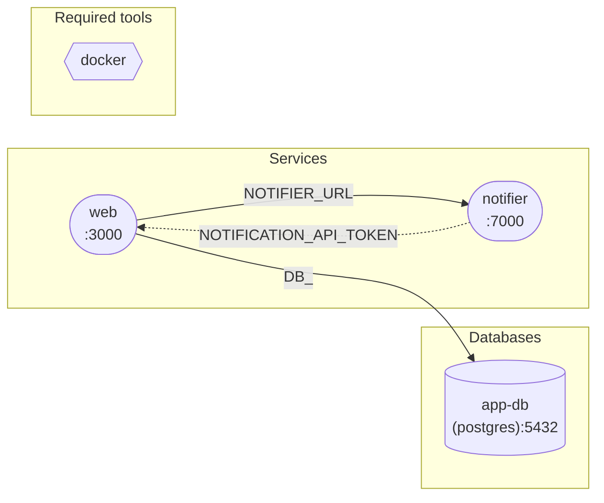

# `/corgi-describe` output format

The slash command `/corgi-describe` writes a single Markdown file (default: `docs/corgi-services.md`). This reference defines its structure so the output stays consistent across projects and re-runs.

## File skeleton

(Outer fence uses four backticks so inner triple-backtick fences nest cleanly.)

````markdown
# <project name> — service map

> <description>

| Key | Value |
|---|---|
| name | <name> |
| useDocker | <true/false> |
| useAwsVpn | <true/false> |
| Source | `corgi-compose.yml` |
| Generated | <ISO date, optional> |

## Relationships

```mermaid
graph LR
  …  (see "Diagram conventions" below)
```

## Required tools

| Tool | Why | checkCmd | Optional |
|---|---|---|---|
| docker | container runtime for dbs | `docker --version` | no |

## Databases

### `<db-name>` — <driver>

- **Host:port** `localhost:5432`  (+ `:port2` if set)
- **Credentials** `user=<user>` / `password=***`
- **Database** `<databaseName>`
- **Version** `<version|latest>`
- **Healthcheck** `<healthCheck path or — >`
- **Seed** `<seedFromFilePath | seedFromDbEnvPath | inline seedFromDb | none>`
- **Additional** — only when present:
  - `queues: [...]`  → `AWS_SQS_<UPPER>`
  - `buckets: [...]` → `AWS_S3_<UPPER>_BUCKET` or `SUPABASE_BUCKET_<UPPER>`
  - `services: [...]`, `jwtSecret`, `authUsers`, `image`, `environment`, `volumes`, `command`, …

(Repeat per db_service.)

## Services

### `<svc-name>`

- **Source** `path: ./svc` *(or `cloneFrom: <url>` on branch `<branch>` → resolved dir `corgi_services/services/<name>/`)*
- **Port** `3000` (envAlias `PORT`)
- **Healthcheck** `http://localhost:3000/health` *(omit if no `healthCheck:`)*
- **Flags** — only when set away from defaults:
  - `manualRun: true`
  - `ignore_env: true`
  - `autoSourceEnv: false`
  - `interactiveInput: true`
  - `runner.name: docker`

**From README** *(omit entire block if no README found or scrape empty)*

> <tagline — first non-heading paragraph, one sentence ≤ 200 chars>

- **Badges**
  - [](https://sonarcloud.io/project/overview?id=org_repo)
  - [](https://github.com/org/repo/actions/workflows/ci.yml)
  - [](https://codecov.io/gh/org/repo)

- **Useful links** *(from `## Links` / `## Resources` / `## Documentation` sections)*
  - [Architecture overview](https://example.com/docs/arch)
  - [Runbook](https://example.com/runbook)

- **Repo** `https://github.com/org/repo`
- **Docs** `https://example.com/docs`
- **SonarCloud** `org_repo` — https://sonarcloud.io/project/overview?id=org_repo

(Truncate to 10 badges + 10 links; append `(+N more in README)` when truncated. Render `readme: not found` and skip the block entirely if the working-copy dir or README is missing.)

**Lifecycle**

```sh
# beforeStart
<cmds>
```

```sh
# start
<cmds>
```

```sh
# afterStart
<cmds>
```

(Omit any block that is empty.)

**Database dependencies**

| db | envAlias | env-var prefix |
|---|---|---|
| `app-db` | `""` | `DB_HOST`, `DB_PORT`, `DB_USER`, `DB_PASSWORD`, `DB_NAME` |
| `cache` | `CACHE_` | `CACHE_REDIS_HOST`, `CACHE_REDIS_PORT`, … |

Use the driver-specific prefix when `envAlias: ""` for non-postgres drivers (`REDIS_`, `MONGO_`, `RABBITMQ_`, …). See `db-drivers.md`.

**Service dependencies**

| target | envAlias | suffix | resolved URL |
|---|---|---|---|
| `notifier` | `NOTIFIER_URL` | `/api/v1` | `http://localhost:7000/api/v1` |

URL host is `localhostNameInEnv` (default `localhost`; `host.docker.internal` when `useDocker: true`).

**Exports**

- `NOTIFICATION_API_TOKEN` — re-export from own env
- `URL` — re-export from own env (expanded `${PORT}` → `7000`)
- `HEALTH=http://localhost:7000/healthz` — inline literal

**Consumed by**

- `app` references `${notifier.URL}`, `${notifier.NOTIFICATION_API_TOKEN}`

**Tunnel** *(only if present)*

- provider: `cloudflared`
- hostname: `${API_TUNNEL_HOST}`  (resolves at `corgi tunnel` time)
- name: `${USER}-api-dev`

**Scripts** *(only if present)*

- `seed-users` — `corgi script -n seed-users`

(Repeat per service.)

## Lifecycle hooks

```sh
# init
<cmds>
```

```sh
# beforeStart
<cmds>
```

```sh
# afterStart
<cmds>
```

## Cycles & warnings

- `<service-a>` ↔ `<service-b>` cycle in `depends_on_services` (corgi will error at runtime).
- `<service-x>` references `${producer.VAR}` but `producer` not in its `depends_on_services`.
- `<service-y>` references `${producer.VAR}` where `VAR` is not in producer's `exports`.
- `<service-z>` has neither `path:` nor `cloneFrom:`.

(Section says "None." when clean.)
````

## Diagram conventions (Mermaid)

Always `graph LR`. Sanitize node IDs: replace any character outside `[A-Za-z0-9_]` with `_` (e.g. yaml key `test_redis-db` → node id `db_test_redis_db`). Always keep the **display label** (inside the brackets) as the original yaml key so the reader sees real names. Use these exact node shapes so multiple diagrams render consistently:

| Element | Syntax | Visual |
|---|---|---|
| Service | `svc_<name>(["<name><br/>:<port>"])` | stadium |
| Database | `db_<name>[("<name><br/>(<driver>):<port>")]` | cylinder |
| Required tool | `tool_<name>` | hexagon |
| Tunnel | `tun_<svc>(((🌐 <hostname>)))` | circle |

Edges:

| Relationship | Syntax | Notes |
|---|---|---|
| Service → DB | `svc_api -->|DB_| db_app_db` | label = `envAlias` or driver prefix when blank |
| Service → Service | `svc_app -->|NOTIFIER_URL| svc_notifier` | label = `envAlias`; append `(suffix)` if set |
| Producer → Consumer (exports) | `svc_notifier -.->|TOKEN, URL| svc_app` | dotted, label lists exported vars consumer actually references |
| Tunnel → Service | `tun_api --> svc_api` | wraps the public hostname |

Subgraphs (group by role, not by tier):

```
subgraph services["Services"]
  svc_…
end

subgraph databases["Databases"]
  db_…
end

subgraph required["Required tools"]
  tool_…
end
```

Tool nodes have no edges — they apply to the whole project, not individual services.

### Worked example

Given this compose:

```yaml
name: shop
services:
  web:
    port: 3000
    depends_on_db:
      - name: app-db
        envAlias: ""
    depends_on_services:
      - name: notifier
        envAlias: NOTIFIER_URL
    environment:
      - TOKEN=${notifier.NOTIFICATION_API_TOKEN}
  notifier:
    port: 7000
    exports:
      - NOTIFICATION_API_TOKEN
      - URL
db_services:
  app-db:
    driver: postgres
    port: 5432
required:
  docker:
    checkCmd: docker --version
```

Diagram:



Note `app-db` (yaml key) → `db_app_db` (sanitized id) but the display label keeps the hyphen.

## Style rules

- Tables over paragraphs.
- Omit a section when its source field is empty rather than printing "none" — except **Cycles & warnings**, which always exists and reads "None." when clean.
- Never include real secrets; render passwords as `***`.
- Never run commands as part of describing — this is parsing only.
- Re-runs overwrite the same file. Tell the user when overwriting.
- README scrape is best-effort. Never fail the whole command on a malformed README — drop that service's **From README** block and continue.
- Badges and links keep their original URLs verbatim. Never rewrite to a tracker / proxy. Never embed raw ``/`<iframe>`; convert to Markdown links.
